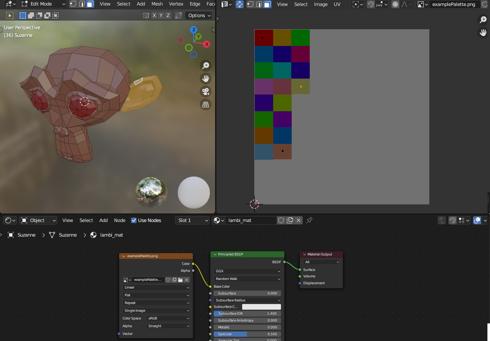

# Synty Assets texture to material conversion
This script can be used in blender to convert Synty-Assets from texture/uv-mapped colors to material colors.

## The problem
Synty-Assets use uv mapping to set the color of faces using a texture as a color pallete.
This might be good for performance since you only need one material for every object. 
However this also means that you cannot change the texture of the object without loosing the color. 
If you do however change the texture then the object won't be able to display it properly since it's not unwrapped correctly.

See the example below.
### Example



## What this script does

In the first few lines you need to define:
- the texture that will used to pick the color from
- the background color of texture
	- this is needed to determine if a uv vertex is placed on the background which means that the texture is most likely the wrong one for that object and is therefore skipped.
- the folder which contains the fbx files you want to convert
- the output folder where the exported meshes should be placed


After launching it, it will do the following for each fbx in the input folder:
- Cleans the workspace (Removes everything in the scene collection as well purges orphans)
- Imports the fbx
- Sets the scale to [1,1,1]
- Looks for a texture node and changes its texture to the given one
	- This is due to there being no texture set after importing
- Looks under each face for a color on the texture using PIL
- Groups the faces by color
- For each color it finds it
	- Selects faces based on color
	- Creates a new material with that color
	- Assigns the material to a new slot
	- Assgins the faces to that slot
- Unwraps the object using "Smart UV Project"
- Exports the object to gltf
	- This is needed for my use-case however you can easily change the export format by ```bpy.ops.export_scene.gltf(filepath=exportPath)``` to ```bpy.ops.export_scene.fbx(filepath=exportPath)``` or any other format.


## Caveats
- You need to install Pillow for python
On Windows:
	- Open the directory where blender is installed
	- Go to into \[BLENDER VERSION]\python\bin
	- Shift+Rightclick into folder and click on "Open PowerShell window here"
	- run ```.\python -m ensurepip --default-pip``` and ```.\python -m pip install Pillow```
- The input folder should not contain any other files other than .fbx files (e.g. .import or .meta)
- The output folder should not be the same as the input folder as it would overwrite the originals when exporting to fbx
- Doesn't yet work with Characters
- The script creates a new material for each color even if that color has been used by a different mesh, meaning that the meshes won't share materials when extracting them inside a game engine.

## Tested with
- Blender 3.6
- Synty's [POLYGON - Samurai Pack](https://syntystore.com/products/polygon-samurai-pack)